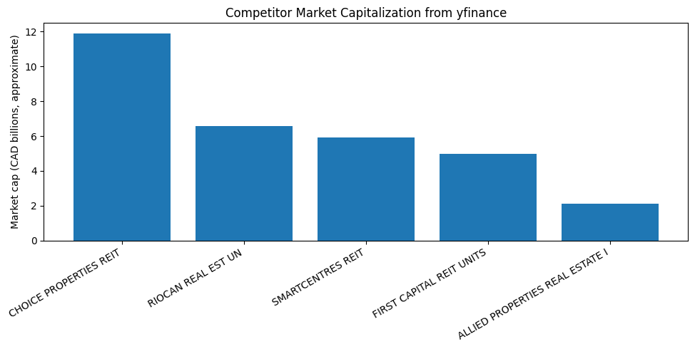

# SmartCentres REIT Investment Analysis

## Overview

This project evaluates SmartCentres Real Estate Investment Trust (SRU.UN) as a potential investment. It brings together company financial results, share-price performance, dividend information, Canadian economic indicators, and peer comparisons to support an evidence-based investment discussion.

Prepared for BSMM-8730: Data Acquisition and Management, University of Windsor, Master of Management.

## Business Question

Is SmartCentres REIT a suitable investment? The analysis considers price performance, distributions, financial strength, property occupancy, peer REITs, interest rates, bond yields, and inflation.

## Team

| Name | Role |
|---|---|
| Pradeepta Kumar Saha | |

## Data Sources

- [SmartCentres REIT](https://smartcentres.com/) - annual reports, financial statements, property information, and distributions
- [Bank of Canada Valet API](https://www.bankofcanada.ca/valet-api-how-to/) - interest rates, bond yields, inflation, and exchange-rate information
- [Yahoo Finance](https://finance.yahoo.com/) - historical share prices, company profiles, and dividend history
- [WOWA](https://wowa.ca/reit-canada) - Canadian REIT peer comparison data
- [SEDAR+](https://www.sedarplus.ca/) - regulatory filings

## Project Files

```text
8730-assignment-main/
|-- README.md
|-- 01_smartcentres_scraping.ipynb
|-- 02_yfinance_scraping.ipynb
|-- 03_bank_of_canada_scraping.ipynb
|-- 04_wowa_scraping.ipynb
|-- 05_eda (2).ipynb
|-- data/                         Collected CSV datasets
|-- pdfs/                         SmartCentres reports and statements
`-- screenshots/                  Charts shown below
```

## Selected Analysis Visualizations

### Competitor Market Capitalization



The chart compares the approximate market capitalization of SmartCentres with Choice Properties, RioCan, First Capital, and Allied Properties.

### Indexed REIT Stock Performance


All five REITs begin at an index value of 100, making their share-price performance directly comparable over time.

### Competitor Dividend and Distribution Yield


The chart compares the dividend or distribution yields reported for SmartCentres and the selected peer REITs.

## Analysis Scope

The notebooks examine:

- SmartCentres share-price trends, daily and monthly returns, and moving averages
- Distribution history and estimated dividend yield
- Rental income, debt, assets, net income, and operating cash flow
- Occupancy and property-count trends
- Competitor market capitalization and dividend/distribution yields
- The relationship between REIT performance, Canadian interest rates, bond yields, and inflation

## How to Run

1. Open the notebooks in Google Colab, Jupyter Notebook, or JupyterLab.
2. Install the required Python packages: `pandas`, `numpy`, `matplotlib`, `yfinance`, `requests`, `beautifulsoup4`, `lxml`, and `pdfplumber`.
3. Run the data-collection notebooks, numbered 01 through 04, to produce or refresh the files in `data/`.
4. Run `05_eda (2).ipynb` to clean the data, calculate measures, and create the charts.

## Use of Large Language Models

An LLM was used to help draft data-collection and charting code in Google Colab. All source data was obtained from the public sources listed above. Generated code and results were reviewed before use, and the final interpretation was completed manually.

### Plain-English prompts used for data collection

1. **SmartCentres information**

   > Find the SmartCentres annual reports and year-end financial statements from 2022 to 2025 on the official SmartCentres website. Collect important information about its properties, occupancy, assets, debt, rental income, cash flow, and distributions. Put the information into organised data tables and keep a note of where each figure came from.

2. **Share prices and competitor information**

   > Collect share-price history from 2021 onward for SmartCentres and four similar Canadian REITs: RioCan, Choice Properties, Allied Properties, and First Capital. Also collect their company size, dividend yield, and 52-week high and low prices. Collect SmartCentres past dividend payments and organise all results in separate tables.

3. **Canadian economic information**

   > Get Canadian economic data from 2021 onward from the Bank of Canada. Include interest rates, inflation, the Canadian dollar compared with the U.S. dollar, and 5-year and 10-year government bond yields. Organise the results by date and clearly label each measure.

4. **Competitor comparison**

   > Use the WOWA Canadian REIT comparison page to find SmartCentres, RioCan, Choice Properties, Allied Properties, and First Capital. Record each company share price, company size, and dividend yield so that the companies can be compared.

### Plain-English prompts used for analysis and graphs

1. > Calculate the relationship between the 5-year Government of Canada bond yield and SmartCentres monthly returns. Explain whether the relationship is positive or negative and what it may mean for a REIT investor.

2. > Plot monthly returns against 5-year bond yields for RioCan, Choice Properties, Allied Properties, and First Capital. Compare their interest-rate sensitivity with SmartCentres.

3. > Show the operating cash-flow trend over the last five years and explain the year-to-year changes.

4. > Draw a line chart showing SmartCentres net-income trend over five years. Use Canadian dollars in millions and explain the main trend.

5. > Draw the same type of line chart for operating cash flow over five years.

6. > Compare the 5-year Government of Canada bond yield with SmartCentres dividend yield over the last five years. Show the difference between the two yields in a clear chart.

7. > Compare SmartCentres dividend yield and the 5-year Government of Canada bond yield with inflation. Show both the stated return and the return after inflation, and explain the difference.

8. > Create a scenario graph showing how slower population growth or lower immigration could put downward pressure on property occupancy. Clearly state that this is an illustrative scenario, not a forecast based on population data.

9. > Create a five-year comparison bar chart of SmartCentres dividend yield and the 5-year Government of Canada bond yield. Explain why historical share-price data is needed to calculate a five-year dividend-yield trend.

10. > Use the WOWA competitor data to compare the current SmartCentres yield with the current yields of its peer REITs. State that WOWA is a single-date snapshot and cannot provide a five-year historical trend.

### Important Data Note

Dividend yield depends on both the annual distribution and the share price used in the calculation. WOWA provides a point-in-time peer comparison, while the five-year yield analysis uses historical year-end market prices. These approaches can show different yield percentages even when the annual distribution amount has not changed.

## License

This project was completed for academic purposes as part of BSMM-8730 at the University of Windsor.
